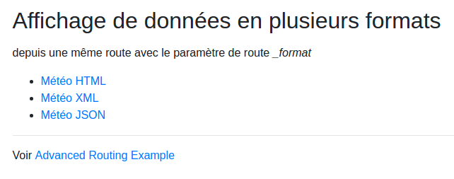

# Formats d'affichages d'une même ressource

## Intérêt

Le contenu d'une page demandée peut tout à fait être rendue de plusieurs façons, en HTML, en XML, en JSON, etc. selon les besoins. Ceci est expliqué ici (Advanced Routing Example) : http://symfony.com/doc/current/routing.html#advanced-routing-example

On nous dit que cette variable `_format` devient accessible depuis l'objet Request, voir : http://api.symfony.com/4.1/Symfony/Component/HttpFoundation/Request.html#method_getRequestFormat

Ce qui n'est pas expliqué ici, c'est comment s'y prendre pour faire en sorte que le template soit conditionné en fonction de ce paramètre :nerd_face: A vous de jouer avec tout ça pour y arriver.

## Objectifs

Depuis une seule route donc, grâce au paramètre `_format`, rendre les templates Twig suivants :

### HTML

- Ne pas hésiter à utiliser Bootstrap pour formater le tableau.
- **Fourni (dossier `css`) : Inclure le sprite CSS des icônes météo (classe `meteo` + prévision)** pour afficher les images correspondant à la prévision du jour. Penser à utiliser la propriété CSS `zoom` afin de réduire le sprite en cas de besoin.

<kbd></kbd>

### XML

- Afficher d'abord un exemple de XML valide statique (trouvé sur le net, peu importe le sujet) pour vous assurer que le format est bon (devrait s'afficher comme sur la capture).
- Transformer ce XML avec la même logique de code que pour le HTML.

<kbd></kbd>

### JSON

- Ici, on peut faire comme pour le XML, ou bien plus simple :wink:
- En bonus, trouver le moyen de rendre l'indentation correcte (sauf si déjà faite par le template, si vous utilisez un template). Cf doc Twig.

<kbd></kbd>

### Accueil

On n'hésitera pas à créer une page d'accueil qui lie vers ces pages, afin de bien voir comment s'écrit cette route.

<kbd></kbd>
